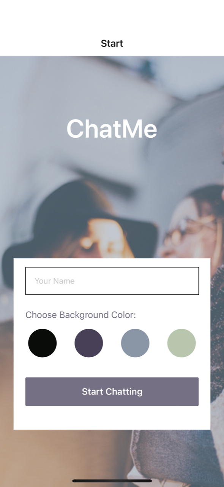
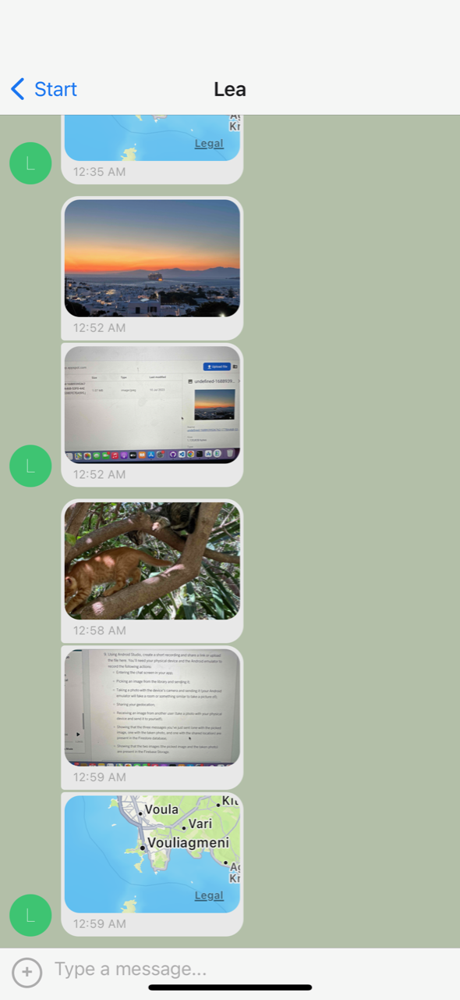
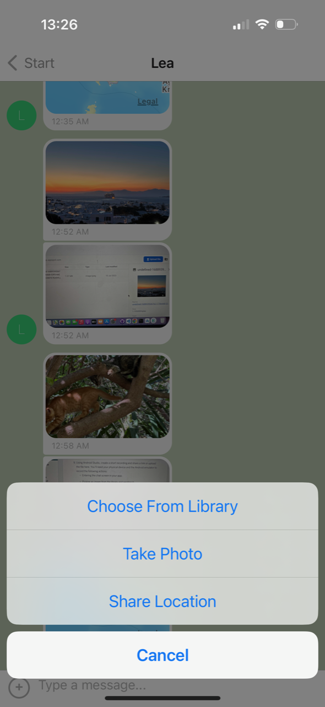

# ChatMe

ChatMe is a simple chat application built with React Native. It allows users to enter their name, select a background color, and start chatting with others.

# App Screenshots

## Tech Stack

- React Native
- Gifted Chat
- Expo
- Firebase & Firestore
- Firebase Authentication for anonymous sign-in
- Firestore Database for storing messages
- Firebase Storage for storing images

## Features

- Enter your name to personalize the chat experience
- Choose a background color for the chat screen
- Start chatting with other users
- Share location
- Share an image from the library
- Take a photo using your camera

## Setup

1. Install Expo CLI globally: `npm install expo-cli -g`
2. Log in to Expo: `expo login`
3. Install dependencies: `npm install`
4. Install the Expo Go App on your mobile device
5. Create your test environment with an Android Emulator or iOS Simulator
6. Start the project: `npm start` or `expo start`

## Dependencies

The following dependencies are required to run the application:

- @react-native-async-storage/async-storage
- @react-native-community/netinfo
- @react-navigation/native
- @react-navigation/native-stack
- expo
- expo-image-picker
- expo-location
- expo-status-bar
- firebase
- react
- react-native
- react-native-gifted-chat
- react-native-maps
- react-native-safe-area-context
- react-native-screens

## Firebase Configuration

To use Firebase services, you need to set up a Firebase project and configure it in your app. Follow these steps:

1. Create a Firebase project on the [Firebase console](https://console.firebase.google.com).
2. Get your Firebase configuration, including the API key, authDomain, projectId, storageBucket, messagingSenderId, and appId.
3. Replace the `firebaseConfig` object in `App.js` with your own Firebase configuration.

## Development

To contribute to the development of the application, follow these steps:

1. Fork the repository.
2. Create a new branch.
3. Make your changes and commit them.
4. Push your changes to your forked repository.
5. Submit a pull request.

## License

This project is licensed under the MIT License. See the [LICENSE](LICENSE) file for more details.
